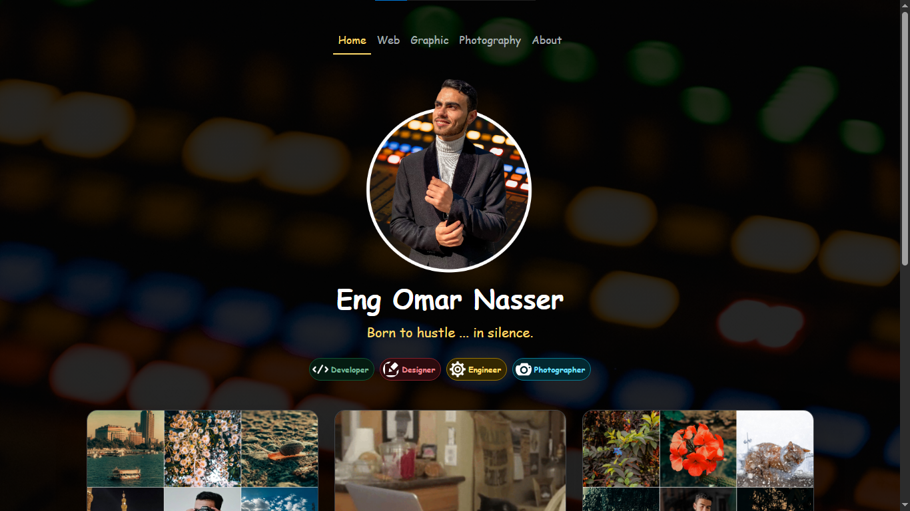
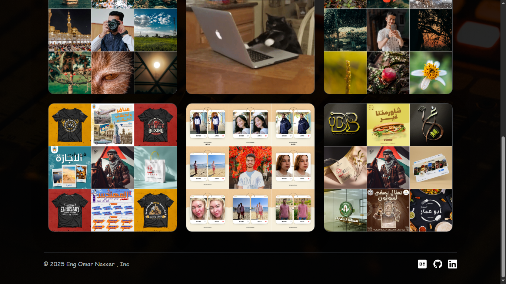
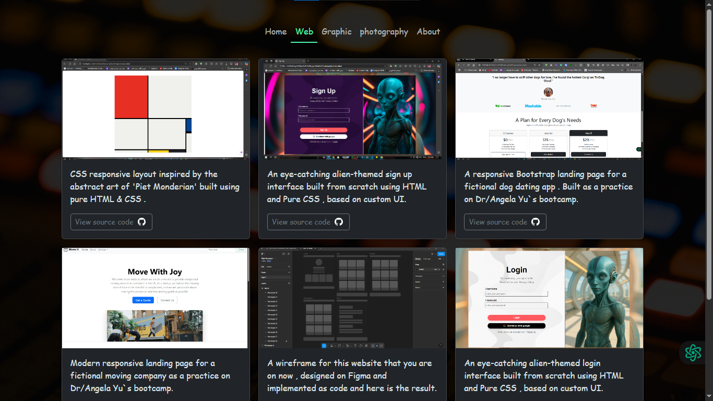
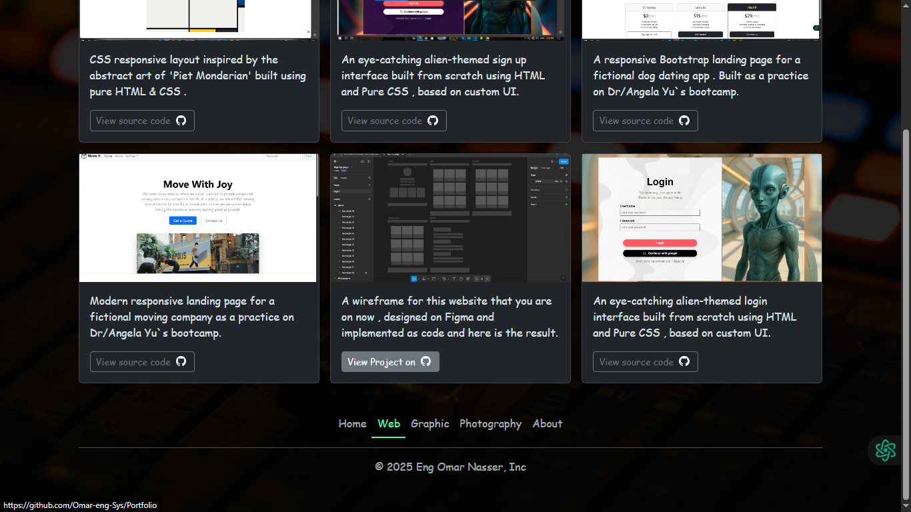
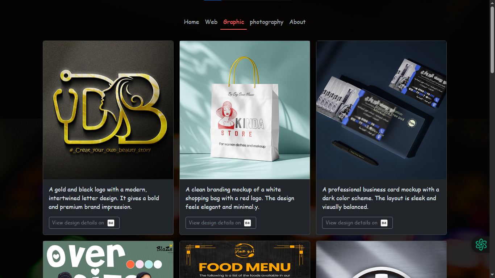
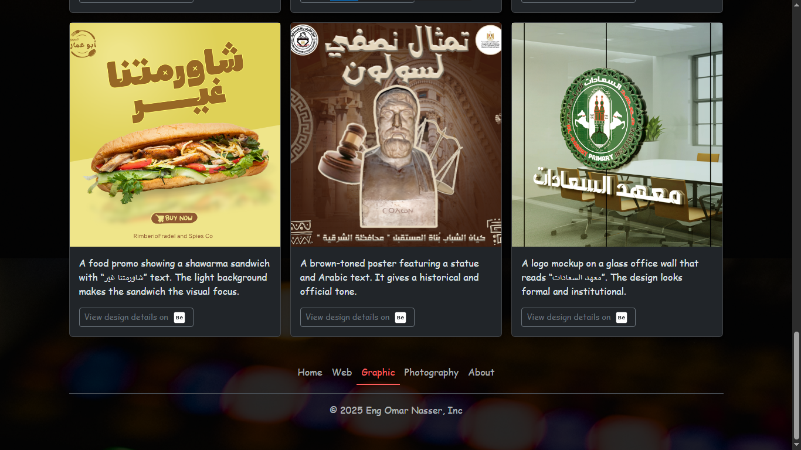
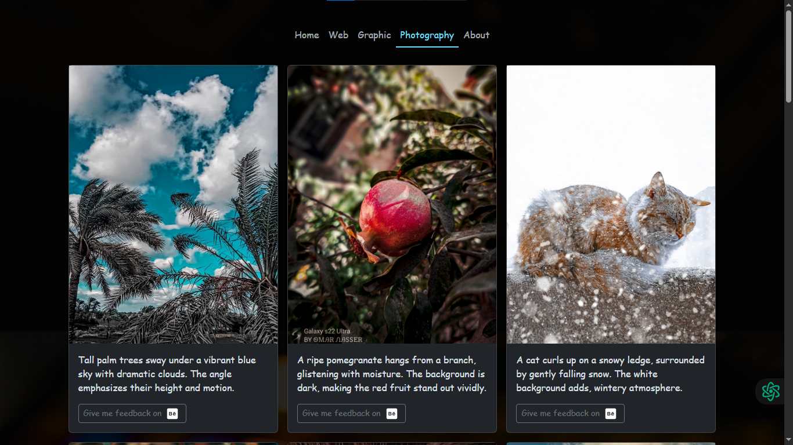
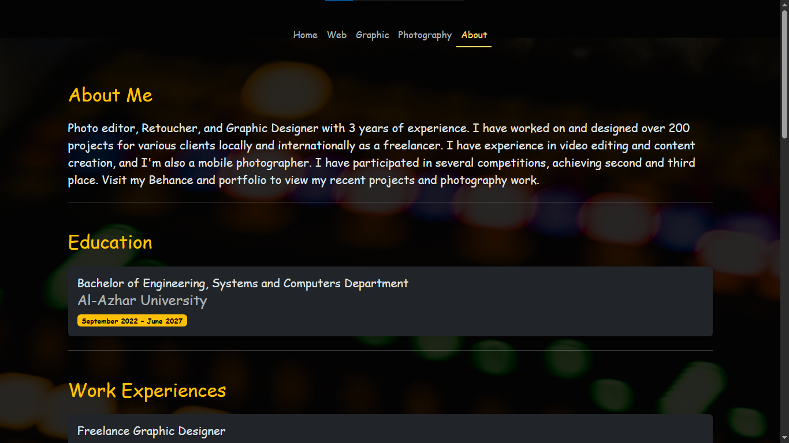
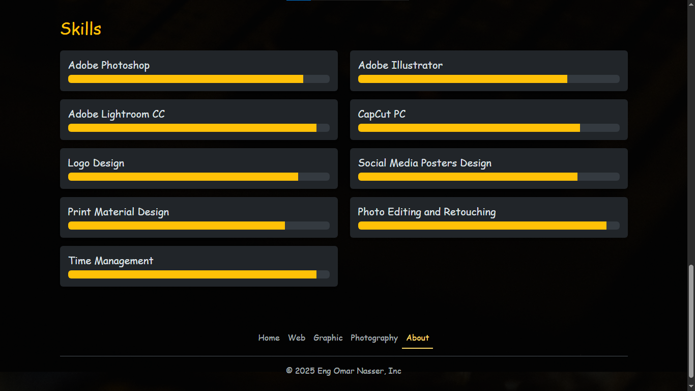
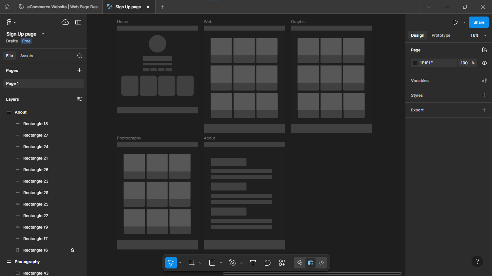

# 🚀 Capstone Project 2 - Portfolio

A modern, responsive portfolio website showcasing my skills in development, design and photography. Built with **Bootstrap 5** and custom CSS.

## 🌐 View Live Website

[](https://omar-eng-sys.github.io/MyPersonalWebsite/)

---

<div align="left">
  
  
  
  
  
  
  
  
  
  
</div>

---

## 📐 Features

- ✅ Fully responsive portfolio website  
- 🎨 Dark theme with Bootstrap 5  
- 🏆 Showcases multiple skills (Development, Design, Photography)  
- 💻 Clean & semantic HTML5  
- 🎯 Custom CSS styling  
- 📱 Mobile-friendly design  

---

## 📂 Project Structure

```bash
project-root/
│
├── index.html            # Main homepage
├── public/
│   ├── web.html          # Web projects page
│   ├── Graphic.html      # Graphic design projects page  
│   ├── Photography.html  # Photography portfolio page
│   ├── About.html        # About me page
│   ├── style.css         # Custom styles
│   └── assets/
│       ├── *.png         # Profile image and icons
│       ├── *.jpg         # Portfolio images
│       └── *.gif         # Animated elements
│
└── README.md             # Project documentation
```

---

## 🛠 Technologies Used

- 
- 
- 

---

## 📄 Design Wireframe on Figma

- 

---

## 🛠 How to Use

1. Clone the repository:
   ```bash
   git clone https://github.com/Omar-eng-sys/portfolio.git
   cd portfolio
   ```

2. Open the project in your browser:
   ```bash
   # Using Live Server or just open index.html manually
   ```

---

## 📌 Future Improvements

- Add more project case studies
- Implement a blog section
- Add contact form functionality
- Enhance animations and interactions

---

## 🙌 Connect With Me

[](https://www.behance.net/d9fb7eb7)
[](https://github.com/Omar-eng-sys)
[](https://www.linkedin.com/in/omar-nasser-74226630b)

---

## 📄 License

© 2025 Eng Omar Nasser. All rights reserved.
